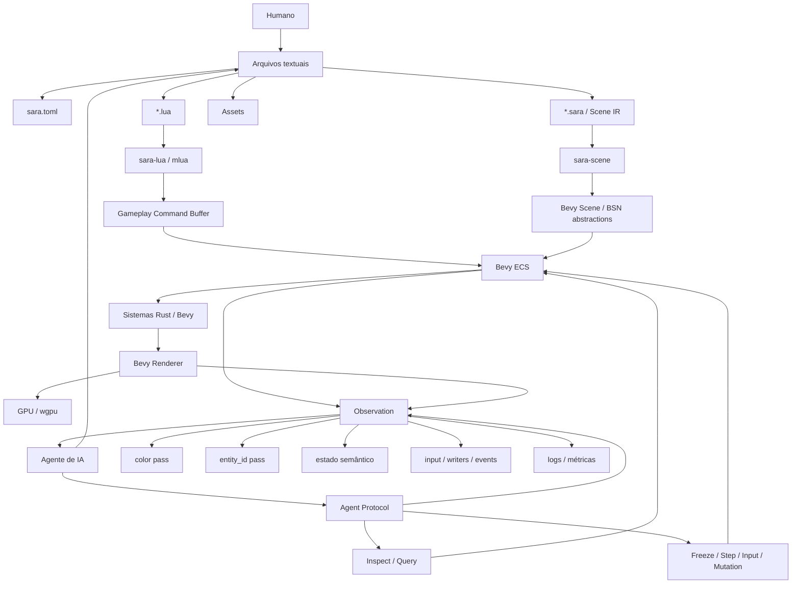

# sara-engine

> **Uma engine de jogos AI-first, construída em Rust sobre Bevy, com Lua para gameplay, cenas textuais como fonte de verdade e um runtime projetado para ser observado, controlado, reproduzido e verificado por agentes.**

## Resumo executivo

A `sara-engine` parte de uma premissa simples: **o principal gargalo de um agente desenvolvendo jogos não é escrever código; é conseguir fechar sozinho o ciclo editar → executar → observar → diagnosticar → corrigir → verificar**.

Os experimentos que originaram o Sara já mostraram esse problema de forma concreta. Godot, Unity e Defold permitiram que agentes terminassem jogos, mas falhas importantes continuaram aparecendo na integração entre estado, cena, tempo, input e plataforma. No BomberBoom, por exemplo, 107 assertions podiam permanecer verdes enquanto no Android um toque gerava dois caminhos de input; mais tarde, o porte Godot reproduziu a mesma classe de problema. O próprio método do Sara já define **AI-first** como a capacidade de um agente descobrir funcionalidades por texto, alterar o projeto sem depender de editor visual, executar, observar estado/geometria/efeitos, reproduzir defeitos, receber falhas explícitas e verificar o resultado sem consumir atenção humana, exceto em critérios deliberadamente humanos como estética e diversão.

A proposta é transformar essas características em propriedades **da engine**, e não em automação acrescentada posteriormente:

```text
Rust / Bevy → mecanismo da engine
.sara → estrutura declarativa do mundo
Lua → comportamento do mundo
Agent Protocol → observação e manipulação do mundo
Observation → prova reproduzível do que aconteceu
```

A escolha de Bevy como fundação tornou-se especialmente forte em 2026. O Bevy 0.19, lançado em 19 de junho de 2026, já fornece um engine data-driven em Rust e introduziu o novo sistema de cenas BSN, com composição, patching e dependências; a infraestrutura para assets de cena já existe, embora o loader oficial de arquivos `.bsn` ainda não seja distribuído na versão 0.19. O Bevy também possui oficialmente o **Bevy Remote Protocol**, baseado em JSON-RPC 2.0, capaz de consultar e alterar o ECS e extensível com métodos customizados. Isso significa que a sara-engine não precisa reinventar ECS, scheduler, renderer, janela, input e toda a infraestrutura inferior para criar sua verdadeira diferenciação.

A descoberta mais relevante desta pesquisa é, portanto:

> **A sara-engine não deve ser uma nova implementação de Bevy. Deve ser uma camada de produto e arquitetura sobre Bevy que torna o runtime nativamente legível, controlável e verificável por humanos e agentes.**

O formato `.sara` também não deve ser congelado cedo demais. O `.tscn` do Godot continua sendo uma referência excelente porque é legível por humanos, amigável a controle de versão e usa UIDs textuais; porém, Bevy 0.19 agora possui BSN e pretende oferecer assets `.bsn`. A recomendação é definir primeiro uma **Scene IR própria e estável**, com UIDs e semântica Sara, e manter o serializer `.sara` desacoplado do backend. Antes de declarar o formato `1.0`, deve haver um portão explícito para decidir se `.sara` permanece formato independente, vira um perfil AI-friendly de BSN ou se BSN amadureceu o suficiente para substituir parte dele.

**Estado das decisões que ainda não estão especificadas:**

| Decisão | Estado |
|---|---|
| Fundação do runtime | **Definida: Bevy** |
| Linguagem principal de gameplay | **Definida: Lua via `mlua`** |
| Modelo de runtime | **Definido: ECS** |
| Interface com agentes | **Definida conceitualmente: Agent Protocol local, estruturado e versionado** |
| Fonte de verdade de cena | **Definida conceitualmente: textual; sintaxe final ainda não congelada** |
| Licença da sara-engine | **Não especificada** |
| Plataformas finais | **Não especificadas** |
| Metas formais de performance | **Não especificadas** |
| Escopo final 2D/3D | **Não especificado; MVP 2D é recomendado pelo corpus existente** |
| Física, networking e editor visual | **Fora do MVP; tecnologias não especificadas** |
| Versão exata de Bevy/Lua | **Não especificada; versões devem ser fixadas no início de cada marco** |

Há ainda uma questão de governança: a ADR 0001 existente proíbe iniciar uma engine completa antes de nova decisão, e a ADR 0003 determina que a passagem de Sara para engine exige nova decisão. Portanto, antes do primeiro commit estrutural da sara-engine, deve ser criada uma ADR datada de **28 de agosto de 2026 ou posterior** registrando que a nova evidência e a decisão do proprietário autorizam **construir sobre Bevy**, sem apagar as ADRs anteriores; o próprio método do projeto determina que decisões substituídas sejam preservadas historicamente.

## Arquitetura e pilares

A arquitetura proposta possui cinco pilares.

| Pilar | Decisão |
|---|---|
| **Bevy como fundação** | ECS, scheduling, rendering, assets, input, janela e infraestrutura de baixo nível pertencem ao Bevy. Bevy é implementação interna, não a API pública da Sara. |
| **Lua para gameplay** | Gameplay cotidiano usa Lua; sistemas que exigirem performance ou integração profunda podem ser implementados como plugins Rust. |
| **Cena textual** | Mundo, entidades, componentes, recursos e relações possuem fonte textual canônica, inspirada no `.tscn`, mas mapeada para ECS e preparada para interoperação com BSN. |
| **Agent Protocol observável** | Tudo que um agente precisa observar ou manipular em runtime possui contrato estruturado e descobrível; MCP é um possível adaptador, não o núcleo. |
| **Execução verificável** | Seed, relógio, input, stepping, replay, estado semântico e captura visual formam uma execução reproduzível e auditável. |

O `.tscn` é particularmente relevante como referência de authoring. A documentação oficial do Godot destaca que TSCN é textual, human-readable e adequado a controle de versão; no Godot 4 ele usa UIDs string para manter referências mesmo quando arquivos são movidos, e sua estrutura explicita recursos externos, internos, nodes e conexões. A Sara deve herdar essas qualidades, mas **não a ontologia `SceneTree/Node` do Godot**.

Há também um ponto novo importante: Bevy 0.19 introduziu BSN como sistema nativo de cenas ECS. Ele já suporta composição, patches, relações entre entidades, templates e dependências de assets; o formato `.bsn` em arquivo ainda não possui loader oficial na versão atual, mas é explicitamente planejado pelo projeto. Isso sugere que a camada de cenas Sara deve ser construída **sobre os conceitos de cena do Bevy**, e não paralelamente a eles.



A separação crítica é:

```text
 gameplay
 │
Lua ──► Sara Gameplay API ──► GameplayCommand ──► ECS

 tooling
 │
Agente ─► Agent Protocol ───┼──► ECS inspection
 ├──► execution control
 └──► Observation
```

Lua não deve conhecer `World`, archetypes, locks nem objetos Bevy diretamente. Da mesma forma, o Agent Protocol público não deveria vazar nomes internos como `bevy_transform::components::transform::Transform` como contrato permanente. O BRP bruto pode permanecer disponível em builds de desenvolvimento, mas `sara.inspect_entity` deve retornar uma representação estável da Sara.

Essa separação permite atualizar Bevy sem obrigar todos os scripts Lua e clientes de agentes a aprenderem a nova API interna.

O Agent Protocol deve ser local por padrão. O transporte HTTP oficial do BRP usa `127.0.0.1` por padrão, nas portas 15702 e, quando há render sub-app, 15703; a implementação HTTP atual não é suportada em WASM. A Sara pode usar esse transporte inicialmente, mantendo a possibilidade de outros transports posteriormente.

## Design técnico e formato de projeto

Um workspace inicial pode ser pequeno e manter fronteiras explícitas:

```text
sara-engine/
├── crates/
│ ├── sara-core/ # IDs, erros, relógio, schemas, tipos públicos
│ ├── sara-runtime/ # composição do App Bevy e schedules
│ ├── sara-scene/ # Scene IR, parser/serializer.sara, hot reload
│ ├── sara-lua/ # mlua, bindings e lifecycle dos scripts
│ ├── sara-protocol/ # Agent Protocol / JSON-RPC
│ ├── sara-observe/ # captures, Observation, replay, diffs
│ └── sara-cli/ # binário `sara`
├── examples/
├── tests/
│ ├── scenarios/
│ ├── replays/
│ └── golden/
└── README.md
```

O projeto deve manter o princípio descoberto pela ADR 0007: **gameplay e observação compartilham o mesmo core, mas a existência do tooling não deve contaminar semanticamente o runtime de release**. Em uma engine própria isso pode ser feito por plugins/features/build profiles, sem necessariamente exigir dois executáveis finais.

A pilha sugerida é:

| Responsabilidade | Escolha inicial | Observação |
|---|---|---|
| ECS/runtime | `bevy` | Fundação da engine |
| Controle remoto | `bevy_remote` | Base BRP + métodos Sara customizados |
| Lua | `mlua` | Binding recomendado |
| `rlua` | **Não usar** | O próprio projeto declara `rlua` depreciado em favor de `mlua` para projetos novos. |
| Serialização | `serde`, `serde_json` | Protocolos e IR |
| Configuração | TOML | `sara.toml`, profiles e testes |
| Scene IR bootstrap | RON é aceitável internamente | Não deve congelar o formato público por conveniência |
| Scene authoring | `.sara`, TSCN-like | Sintaxe ainda experimental |
| Rendering | Bevy Renderer | Não adicionar `wgpu` direto até existir necessidade real de um pass especializado |
| Scripting VM | Lua via `mlua` | Versão exata configurável/fixada por release |
| Hot reload | `sara-scene` + `sara-lua` | Aplicação transacional |

`mlua` 0.12 suporta Lua 5.5, 5.4, versões anteriores, LuaJIT e Luau, além de builds vendorizados. O runtime exato de Lua deve ser uma escolha substituível no início; não vale transformar “Lua 5.x versus LuaJIT” em parte da API pública antes de benchmarks. `rlua`, por outro lado, tornou-se apenas um wrapper transitório e sua própria documentação recomenda usar `mlua` diretamente em código novo.

Existem precedentes suficientes para considerar Rust + Bevy/ECS + Lua uma combinação tecnicamente comprovada. `bevy_mod_scripting` fornece Lua, hot loading, bindings e callbacks sobre Bevy; Aberred usa `bevy_ecs` + `mlua`; Sindri combina Rust, `wgpu`, `mlua`, hot reload e tooling local orientado a IA. São referências úteis, embora nenhuma deva ser tomada como arquitetura pronta da Sara.

**Identidade de entidades.** O `Entity` do Bevy não deve aparecer em arquivos `.sara`, replays ou contratos persistentes. A própria documentação do Bevy recomenda uma identificação secundária para sincronizar entidades entre instâncias e declara que a forma numérica de um `Entity` serve apenas dentro da mesma instância. Portanto:

```text
SaraEntityId Bevy Entity
entity://player ─────► 4294967301
persistente efêmero
texto / replay / RPC runtime
```

Uma entidade carregada recebe algo como:

```rust
#[derive(Component, Clone, Eq, PartialEq, Hash)]
pub struct SaraEntityId(pub String);
```

e a engine mantém:

```text
SaraEntityId <-> Bevy Entity
```

em um índice do runtime. O identificador Bevy e sua geração continuam úteis internamente para detectar referências runtime obsoletas; não são identidade persistente.

**Formato de projeto proposto:**

```text
game/
├── sara.toml
├── scenes/
│ ├── main.sara
│ └── player.sara
├── scripts/
│ ├── player.lua
│ └── enemy.lua
├── assets/
│ ├── sprites/
│ └── audio/
└── tests/
 ├── touch_bomb.sara-test.toml
 └── replays/
```

Um primeiro `.sara` poderia ser deliberadamente parecido com TSCN:

```ini
[sara_scene format=1 uid="scene://main"]

[ext_resource id="player_script" type="lua" path="scripts/player.lua"]
[ext_resource id="player_texture" type="image" path="assets/sprites/player.png"]

[entity uid="entity://player" name="Player"]
Transform2D = { translation = [128.0, 96.0], rotation = 0.0 }
Sprite = { image = ExtResource("player_texture") }
LuaScript = { source = ExtResource("player_script") }

[entity uid="entity://bomb_socket" name="BombSocket" parent="entity://player"]
Transform2D = { translation = [0.0, 16.0] }
```

Essa sintaxe é **ilustrativa, não um contrato congelado**. O contrato a estabilizar primeiro é uma representação intermediária:

```text
Scene
 ├── uid
 ├── resources[]
 └── entities[]
 ├── stable_uid
 ├── parent_uid?
 └── components[]
```

O loader converte essa IR para o sistema nativo de cenas/ECS do Bevy. Isso permitirá substituir o parser sem alterar o runtime.

Um ponto de revisão obrigatório deve existir antes de `format=1` definitivo: o Bevy 0.19 já tem BSN, e o projeto upstream pretende fornecer `.bsn` em arquivos com hot reload. **Não faz sentido a Sara manter para sempre um formato paralelo se o futuro `.bsn` entregar a mesma semântica com boa ergonomia para agentes.**

**Command buffer.** Lua não deve realizar mutações arbitrárias diretamente no `World`. As chamadas produzem comandos Sara:

```text
Lua callback
 ↓
GameplayCommand::Translate(...)
GameplayCommand::Spawn(...)
GameplayCommand::PlayAnimation(...)
 ↓
Sara Command Buffer
 ↓
validation + tracing + ownership
 ↓
Bevy Commands / World
```

Isso é compatível com a arquitetura do próprio Bevy: `Commands` já representa uma fila de alterações estruturais diferidas e as aplica posteriormente em sequência. A camada extra da Sara é importante porque cria um lugar onde a engine pode **validar, registrar provenance e detectar ownership** antes de entregar a mutação ao ECS.

Hot reload segue o mesmo modelo. Uma alteração de script ou cena é analisada primeiro; somente uma versão válida é aplicada, idealmente como transação. Estado persistente pertence ao ECS, não a globais Lua. Assim, trocar `enemy.lua` não exige destruir o inimigo para atualizar seu comportamento.

## Agent Protocol e observabilidade

O Agent Protocol é o principal diferencial da sara-engine.

Não deve ser sinônimo de MCP. A hierarquia recomendada é:

```text
Claude Code / Codex / outro agente
 │
 MCP adapter
 │
 ├──────── opcional
 ▼
 Sara Agent Protocol
 JSON-RPC 2.0
 │
 sara-runtime
```

Isso impede que a arquitetura da engine dependa de um protocolo específico de assistente.

O BRP oferece uma excelente base: ele usa JSON-RPC 2.0, possui métodos para consultar e modificar componentes e permite registrar métodos customizados no `RemotePlugin`; Bevy também possui descoberta de métodos/protocolo. O Agent Protocol Sara deve usar essa infraestrutura sem tornar a API pública equivalente ao BRP interno.

O contrato segue a disciplina já adotada pelo Sara: **forma versionada, erro tipado e nenhuma interpretação silenciosa**. A ADR 0006 justifica contrato estrito justamente porque, quando o consumidor é um agente, tolerância ambígua frequentemente vira adivinhação.

Superfície inicial:

| Método público | Função |
|---|---|
| `inspect_world` | Resumo do mundo, entidades, componentes, tick e hashes |
| `inspect_entity` | Estado semântico completo de uma entidade |
| `capture_frame` | Solicita um ou mais passes visuais |
| `freeze` | Congela a simulação em uma barreira consistente |
| `step_frame` | Executa exatamente um ou N verification frames |
| `send_input` | Injeta input físico ou lógico com provenance |
| `diff_frames` | Compara duas observações, visual e semanticamente |
| `record_replay` | Inicia/finaliza registro de uma execução reproduzível |

No wire, os métodos devem ser namespaced:

```json
{
 "jsonrpc": "2.0",
 "id": 1,
 "method": "sara.freeze",
 "params": {
 "reason": "agent_inspection"
 }
}
```

```json
{
 "jsonrpc": "2.0",
 "id": 1,
 "result": {
 "schema_version": 1,
 "state": "frozen",
 "tick": 1841
 }
}
```

Um passo verificável:

```json
{
 "jsonrpc": "2.0",
 "id": 2,
 "method": "sara.step_frame",
 "params": {
 "count": 1,
 "render": true,
 "capture": ["color", "entity_id"]
 }
}
```

```json
{
 "jsonrpc": "2.0",
 "id": 2,
 "result": {
 "schema_version": 1,
 "tick": 1842,
 "world_hash": "blake3:...",
 "observation_id": "obs://1842"
 }
}
```

Input deve admitir nível físico para tornar rastreável justamente a classe de defeito descoberta no BomberBoom:

```json
{
 "jsonrpc": "2.0",
 "id": 3,
 "method": "sara.send_input",
 "params": {
 "kind": "touch",
 "finger": 0,
 "phase": "pressed",
 "position": [382, 611],
 "platform_profile": "android-touch"
 }
}
```

O runtime poderia registrar:

```text
PhysicalInput p:908
└── touch finger=0 pressed
 ├── InputEvent i:909
 │ └── route=touch
 │ └── action=place_bomb
 │
 └── InputEvent i:910
 └── route=mouse_emulation
 └── action=place_bomb
```

E produzir:

```text
SAR-INPUT-DUPLICATE

physical_input: p:908
effect: player.place_bomb
routes:
 - touch
 - mouse_emulation
```

Esse desenho deriva diretamente de uma regressão real do corpus: toque e mouse emulado chegaram ao mesmo efeito no BomberBoom, e o porte Godot voltou a revelar a mesma classe de defeito.

**Observation** deve ser uma entidade formal do protocolo. A ADR do spike visual já chegou à unidade correta: `imagem + estado semântico + sequência de entradas + instante + logs`. A engine pode torná-la mais completa:

```json
{
 "schema_version": 1,
 "observation_id": "obs://1842",
 "run_id": "run://7f203b",
 "tick": 1842,
 "simulation_time_ns": 30700000000,
 "seed": 4811,
 "engine_build": "sara-engine@abc123",
 "content_hash": "blake3:...",
 "world_hash": "blake3:...",
 "platform_profile": "android-touch",

 "frame": {
 "color": "captures/1842/color.png",
 "entity_id": "captures/1842/entity_id.png",
 "depth": null,
 "ui": "captures/1842/ui.png",
 "entity_lookup": "captures/1842/entities.json"
 },

 "input": [
 {
 "physical_id": "p:908",
 "kind": "touch",
 "routes": ["touch", "mouse_emulation"],
 "effects": ["player.place_bomb"]
 }
 ],

 "events": [],
 "writers": [],
 "logs": [],
 "metrics": {
 "simulation_ms": 0.42,
 "lua_ms": 0.08,
 "capture_ms": 2.31
 }
}
```

A captura deve ser **multi-pass**. Não porque um modelo multimodal seja incapaz de olhar o frame final, mas porque pixels sozinhos escondem causalidade.

```text
color.png → o que o jogador vê
entity_id.png → quem ocupa cada pixel
depth → relação espacial
ui → interface isolada
colliders → geometria física
semantic.json → valores e componentes
```

Para o `entity_id pass`, a recomendação é não tentar codificar o `SaraEntityId` diretamente no pixel. Cada frame recebe tokens compactos:

```text
pixel RGB #00002A
 ↓
render_token 42
 ↓
entities.json
 ↓
entity://player
```

O pass deve ser sem iluminação/blending e produzir lookup separado. Assim um agente pode perguntar:

```bash
sara inspect pixel --observation obs://1842 --x 430 --y 211
```

e receber a entidade, seu bounding box, componentes e writers.

Bevy já possui suporte nativo a screenshot e trata a captura como uma operação assíncrona, sinalizando quando a imagem está pronta. A Sara deve esconder essa assincronicidade no protocolo: `capture_frame` pode responder com job/receipt ou aguardar uma condição limitada, mas nunca fingir que a imagem está pronta antes do readback.

**Ownership de writers** deve existir dentro do runtime, não ser inferido depois por análise estática. Cada mutação relevante possui provenance:

```text
Property:
 entity://card
 Transform.translation

Writer:
 animation://raise_card
 created_by: scripts/card.lua:set_elevated
 acquired_tick: 1432
 released_tick: 1447
```

Uma propriedade pode ter três políticas:

```text
exclusive
 apenas um writer

serialized
 writers diferentes, mas nunca sobrepostos

blend
 vários contributors → mixer → único writer efetivo
```

Isso resolve de forma mais precisa o caso real do Gods: o analisador inicial viu diferentes caminhos capazes de animar `position`, mas o projeto possuía um owner centralizado que encerrava a Tween anterior antes de iniciar a seguinte. Numa engine Sara, o runtime não precisa deduzir esse padrão: ele registra aquisição, cancelamento e liberação da propriedade.

O panorama externo mostra que essa direção não é apenas teórica. Projetos Godot MCP já oferecem inspeção de scene tree, screenshots, input e controle de runtime; um deles implementa `freeze → step → screenshot`. MCP for Unity expõe edição, controle de cenas e testes através de uma interface estruturada, e a implementação possui inclusive publicação acadêmica associada. Mais significativamente, o próprio Defold lançou oficialmente a **Automation Bridge**, uma extensão de debug com inspeção de cena, input, screenshots, sincronização e API HTTP local versionada. A categoria `agent ↔ runtime` já existe; a diferenciação da Sara é fazer disso **o modelo fundamental da engine**, com ligação direta ao ECS, determinismo e provenance.

## Lua, execução e determinismo

Lua deve operar sobre **handles pequenos**, nunca sobre referências Rust cruas.

```rust
use mlua::{UserData, UserDataMethods};
use std::sync::mpsc::Sender;

#[derive(Clone)]
struct EntityHandle {
 id: String,
 commands: Sender<GameplayCommand>,
}

enum GameplayCommand {
 Translate {
 entity: String,
 x: f32,
 y: f32,
 },
}

impl UserData for EntityHandle {
 fn add_methods<M: UserDataMethods<Self>>(methods: &mut M) {
 methods.add_method(
 "translate",
 |_, this, (x, y): (f32, f32)| {
 this.commands
.send(GameplayCommand::Translate {
 entity: this.id.clone(),
 x,
 y,
 })
.map_err(mlua::Error::external)?;

 Ok(())
 },
);
 }
}
```

O handle contém identidade e acesso à fila, não posse do ECS:

```text
Lua EntityHandle("entity://player")
 │
 ▼
GameplayCommand
 │
 ▼
resolve SaraEntityId
 │
 ▼
Bevy Entity(runtime)
 │
 ▼
World
```

Um script pode permanecer pequeno:

```lua
local Player = {}

function Player.on_create(self)
 self.speed = 220
end

function Player.update(self, dt)
 local x, y = input.axis("move")

 self.entity:translate(
 x * self.speed * dt,
 y * self.speed * dt
)

 if input.pressed("bomb") then
 self.entity:emit("place_bomb")
 end
end

return Player
```

`mlua` implementa `UserData` exatamente para expor tipos Rust e seus métodos a Lua. O default do `mlua` é `!Send`; o recurso `send` permite atravessar threads, mas sincroniza acesso à VM internamente. Para o MVP, a escolha mais simples é deliberada:

```text
Bevy scheduler
├── Rust systems paralelo quando apropriado
├── rendering próprio pipeline
├── assets assíncrono
└── Lua gameplay phase uma VM / execução serializada
```

Lua não precisa ser a camada de paralelismo. Isso melhora previsibilidade, simplifica hot reload e reduz a superfície de bugs de reentrância. Sistemas pesados podem sair de Lua e virar sistemas/plugins Rust sem alterar a API do jogo.

O GC deve ser observável. Lua oferece collectors incremental e generational, e `mlua` permite controlar o collector; além disso, `RegistryKey` exige cuidado porque referências mantidas no registry podem sobreviver e ciclos criados incorretamente podem não ser coletados como esperado. Portanto, a Sara deve medir `lua_memory_bytes`, `gc_time`, número de allocations quando disponível e oferecer budgets/configuração de GC no profile de desenvolvimento, sem otimizar prematuramente.

**Determinismo não significa apenas usar `FixedUpdate`.** O relógio fixo do Bevy é adequado a lógica com timestep constante, mas a própria documentação explica que `FixedUpdate` pode executar zero, uma ou várias vezes dentro de um único update/render frame, dependendo do acumulador. Portanto `sara.step_frame` precisa de semântica Sara própria.

Em **verification mode**, um `frame` significa:

```text
receber inputs do tick N
 ↓
avançar relógio lógico exatamente Δt
 ↓
executar exatamente um simulation tick
 ↓
aplicar command buffers
 ↓
executar ownership/input diagnostics
 ↓
render extraction
 ↓
opcionalmente render/capture
 ↓
produzir Observation N
```

Isso é distinto de “esperar o próximo frame da janela”.

Os invariantes de verification mode devem ser:

```text
seed explícita
+ relógio lógico
+ input registrado por tick
+ ordem conhecida de efeitos mutáveis
+ command buffers em barreiras explícitas
+ nenhuma dependência de wall clock no gameplay
+ content hash
+ world hash
+ replay versionado
```

CLI proposta:

```bash
# Desenvolvimento normal com hot reload
sara run scenes/main.sara --watch

# Inspeção de um jogo em execução
sara inspect world
sara inspect entity entity://player

# Congelar e avançar precisamente
sara freeze
sara step 1
sara step 10

# Passar um tick e gerar evidência visual
sara step 1 --capture color,entity_id

# Descobrir a origem de um input
sara trace input --last 1

# Teste sem janela/render
sara test tests/scenarios/touch-bomb.sara-test.toml \
 --headless \
 --seed 4811

# Replay determinístico
sara replay tests/replays/touch-bomb.sarareplay \
 --assert-world-hash

# Captura offscreen quando a prova realmente exige pixels
sara test tests/scenarios/explosion.sara-test.toml \
 --render-offscreen \
 --capture color,entity_id

# Comparação
sara diff obs://1841 obs://1842
```

`--headless` deve significar **simulação sem dependência de renderização**. Captura visual em CI deve ser uma modalidade separada, `--render-offscreen`, porque screenshot continua exigindo renderer/GPU ou backend apropriado.

Replay deve incluir pelo menos:

```text
engine build/hash
scene/content hash
schema version
seed
timestep
platform profile
input físico por tick
RPC mutations que alteraram o mundo
```

Isso permite reproduzir:

```bash
sara replay failure.sarareplay
```

sem reconstruir manualmente o cenário.

Há dois níveis diferentes de determinismo e eles não devem ser confundidos:

| Nível | Contrato |
|---|---|
| **Simulation determinism** | Mesma build + assets + seed + sequência de comandos/inputs → mesmo hash de estado |
| **Visual determinism** | No mesmo ambiente gráfico fixado → captura idêntica ou dentro de política declarada |

A própria matriz de riscos atual já identifica GPU, fontes e plataforma como fontes de variação visual. Portanto, **pixel-perfect entre GPUs/OS diferentes não deve ser prometido no MVP**. Entre ambientes distintos, a prova pode combinar entity IDs, bounding boxes, estado semântico e diff visual tolerante; no mesmo ambiente de CI, pixel exact pode ser uma fitness function.

Isso preserva a unidade de evidência originalmente proposta pelo Sara em vez de reduzir “visão” a screenshots.

## Roadmap, riscos e alternativas

O MVP deve provar a arquitetura em **fatias verticais**, não construir uma engine completa horizontalmente. O corpus existente é ideal para isso: os projetos pessoais já incluem BomberBoom em Defold, seu porte Godot, Boomlitude, Mineboom e Gods, com centenas de arquivos analisados e regressões históricas classificadas.

O BomberBoom e Gods devem virar **conformance games**, não apenas demos.

| Marco | Entrega | Prova |
|---|---|---|
| **Foundation** | Bevy + Scene IR + CLI mínima | carregar uma cena `.sara`, criar entidades com IDs persistentes, renderizar |
| **Lua vertical slice** | `mlua` + handles + command buffer + hot reload | player controlado inteiramente por Lua |
| **Verified runtime** | seed, freeze, step, world hash, headless replay | dez execuções do mesmo cenário terminam no mesmo estado no ambiente fixado |
| **Observation** | color + entity_id + semantic state + logs | agente localiza uma regressão visual sem pessoa olhar |
| **Provenance** | input tracing + writer ownership | regressões BomberBoom/Gods tornam-se verificáveis |
| **Agent loop** | Agent Protocol + CLI/MCP adapter | agente modifica, roda, observa, corrige e comprova |

O primeiro pass visual obrigatório deve ser `color + entity_id`; depth, collider, normals e passes especializados podem crescer apenas quando um cenário real os exigir.

A checklist de MVP é:

- [ ] **Formalizar a nova ADR:** Bevy como fundação da sara-engine, substituindo/restringindo as ADRs que ainda proíbem iniciar a engine.
- [ ] **Criar o workspace:** `sara-core`, `sara-runtime`, `sara-scene`, `sara-lua`, `sara-protocol`, `sara-observe` e `sara-cli`, com versões exatas das dependências fixadas.
- [ ] **Implementar Scene IR + `.sara` experimental:** UIDs estáveis, round-trip canônico e mapping para Bevy Scene/ECS; revisar BSN antes de congelar `format=1`.
- [ ] **Implementar Lua gameplay:** `mlua`, `EntityHandle`, command buffer, lifecycle e hot reload sem expor referências Bevy.
- [ ] **Implementar verification mode:** seed, relógio lógico, `freeze`, `step_frame`, world hash, headless e replay.
- [ ] **Implementar Agent Protocol v0:** `inspect_world`, `inspect_entity`, `send_input`, `capture_frame`, `diff_frames` e `record_replay`, com schema estrito e erros tipados.
- [ ] **Implementar Observation v0:** `color`, `entity_id`, estado semântico, input trace, writer trace e logs no mesmo manifesto.
- [ ] **Validar com BomberBoom e Gods:** reproduzir input duplicado e ownership de animação, além de uma regressão visual injetada corrigida autonomamente por agente.

Os principais riscos e mitigadores são:

| Problema | Estratégia Sara |
|---|---|
| **Latência do Agent Protocol** | batch queries; filtros; `changed_since`; payloads grandes como artefatos em disco, não JSON/base64 gigante |
| **Readback da GPU** | captura sob demanda; API assíncrona internamente; Observation só fecha quando todos os receipts estiverem prontos |
| **Multithreading e determinismo** | Lua serial no MVP; mutações observáveis aplicadas em barreiras; paralelismo livre apenas onde não altera resultado |
| **GC de Lua** | métricas, budgets e collector configurável; não guardar `World`/ownership pesado em userdata |
| **Handles inválidos** | `SaraEntityId` persistente + resolução runtime + geração Bevy apenas interna |
| **Múltiplos writers** | ownership explícito: exclusive/serialized/blend |
| **Diferenças de plataforma** | `PlatformProfile` declarativo + aparelho real permanece portão quando necessário |
| **Touch + mouse emulado** | todo evento derivado preserva `physical_input_id`; duplicação vira rastreável em vez de efeito silencioso |
| **Pixels diferentes entre GPUs** | estado/entity_id como oráculo principal; pixel-exact apenas em ambiente fixado |
| **API interna do Bevy mudando** | não expor tipos Bevy como contrato público; adapter entre Sara API e Bevy |
| **Lua travando um frame** | hook/budget opcional em development mode; erro tipado e stack trace |
| **Agent Protocol exposto na rede** | loopback por padrão; autenticação explícita antes de qualquer bind não local |

A experiência recente em outras engines confirma várias dessas decisões. O Defold Automation Bridge oficial mantém sua API apenas em debug builds, expõe capabilities e erros estruturados e separa operações do editor das operações do jogo em execução; sua documentação também recomenda sincronização por estado observável em vez de sleeps fixos. Isso é muito próximo da direção correta para Sara, mas aqui o protocolo pode ser nativo da arquitetura e ligado diretamente ao ECS.

**Comparação das alternativas:**

| Caminho | Tempo até protótipo | Controle AI-first | Rust/ECS nativo | Lua | Custo estrutural | Veredito |
|---|---|---|---|---|---|---|
| Plugin/MCP sobre Godot | **Baixo** | Alto, mas limitado pelo modelo existente | Não | possível por extensão | Baixo | Excelente laboratório |
| Fork de Godot | Médio/alto | Muito alto | Não | possível | **Muito alto**, especialmente manutenção da fork | Não escolhido |
| Camada sobre Defold | Baixo/médio | Alto; Automation Bridge oficial já cobre muito | Não | **Nativo** | Médio | Excelente referência |
| **Construir sobre Bevy** | **Médio** | **Muito alto** | **Sim** | via `mlua` | **Médio** | **Escolhido** |
| Engine totalmente do zero | Muito alto | Máximo | Sim | livre | **Extremo** | Não justificado |

Godot já possui múltiplos MCPs capazes de fechar partes substanciais do ciclo run/inspect/input/screenshot e até frame stepping, demonstrando que um plugin pode chegar longe. O problema é que, para Sara, isso ainda deixa a arquitetura fundamental pertencendo ao SceneTree e aos contratos Godot.

Defold foi ainda mais longe oficialmente ao publicar sua Automation Bridge de debug com inspeção, input determinístico, screenshots e sincronização; a comunidade também possui `defold-mcp` com parsing, build, hot reload, live control e visual feedback. Isso valida a necessidade, mas não entrega o objetivo Rust/ECS.

Bevy oferece o ponto intermediário: engine Rust madura o suficiente para fornecer infraestrutura essencial, ECS como modelo fundamental, BRP como embrião do Agent Protocol e, desde 0.19, um sistema de cenas declarativo que reduz ainda mais a quantidade de infraestrutura que Sara precisaria inventar.

Projetos Rust recentes mostram que a interseção **Rust + Lua + text-first + AI tooling** também começou a aparecer. Sindri se descreve como engine Rust 2D com `wgpu`, `mlua`, hot reload e tooling local de IA; nAIVE se apresenta explicitamente como AI-native, usa Rust, Lua e arquivos textuais e possui servidor MCP próprio; Aberred combina `bevy_ecs` e `mlua`. Nenhum deles elimina, porém, a tese da Sara: a oportunidade está em tornar **observabilidade causal, verification mode, provenance de input/writers e Observation estruturada** parte do contrato central.

Os próximos passos imediatos são, portanto:

```text
nova ADR
 ↓
Bevy spike mínimo
 ↓
Scene IR + stable IDs
 ↓
Lua + command buffer
 ↓
freeze / step / world hash
 ↓
color + entity_id Observation
 ↓
BomberBoom input regression
 ↓
Gods writer ownership regression
 ↓
agente corrige uma regressão sem inspeção humana
```

Somente depois desse percurso devem entrar editor visual próprio, física geral, networking, mobile export, 3D avançado ou marketplace. Isso preserva a disciplina que originou o Sara: experimentar um mecanismo por vez, estabelecer critérios antes do resultado e não construir infraestrutura sem uma hipótese que ela esteja testando.

## Referências

**Bevy — fontes prioritárias**

[Bevy 0.19 — anúncio oficial](https://bevy.org/news/bevy-0-19/) — introduz o novo sistema de cenas BSN e descreve a direção futura de assets `.bsn`.

[Bevy Scene / BSN — documentação](https://docs.rs/bevy/latest/bevy/scene/) — semântica de `Scene`, `SceneList`, composição, templates, patching e planos para `.bsn`.

[BSN syntax reference](https://docs.rs/bevy/latest/bevy/scene/prelude/macro.bsn.html) — referência da sintaxe corrente do `bsn!`.

[Bevy Remote Protocol](https://docs.rs/bevy_remote/latest/bevy_remote/) — JSON-RPC, inspeção/mutação do ECS e extensão por métodos customizados.

[RemotePlugin](https://docs.rs/bevy_remote/latest/bevy_remote/struct.RemotePlugin.html) — entrada para métodos remotos customizados.

[Remote HTTP Plugin](https://docs.rs/bevy_remote/latest/bevy_remote/http/struct.RemoteHttpPlugin.html) — transporte HTTP, loopback e limitações atuais de WASM.

[Bevy fixed timestep](https://docs.rs/bevy_time/latest/bevy_time/struct.Fixed.html) — importante para distinguir timestep fixo de frame stepping verificável.

[Bevy Commands](https://docs.rs/bevy/latest/bevy/ecs/system/struct.Commands.html) — command queue e mutações diferidas.

[Bevy Entity](https://docs.rs/bevy_ecs/latest/bevy_ecs/entity/struct.Entity.html) — base para a decisão de manter um `SaraEntityId` persistente separado do ID runtime.

[Bevy Screenshot](https://docs.rs/bevy/latest/bevy/render/view/window/screenshot/struct.Screenshot.html) — captura assíncrona de frames.

**Lua / Rust**

[`mlua`](https://docs.rs/mlua/latest/mlua/) — binding recomendado para Lua em Rust; suporta Lua 5.x, LuaJIT e Luau e permite `UserData` Rust.

[`rlua`](https://docs.rs/crate/rlua/latest/source/README.md) — hoje depreciado em favor de `mlua`; útil apenas como referência histórica/migração.

[Lua Reference Manual](https://www.lua.org/manual/) — referência oficial da linguagem e do garbage collector.

[`bevy_mod_scripting`](https://github.com/makspll/bevy_mod_scripting) — referência relevante de scripting/hot reload sobre Bevy, incluindo Lua via `mlua`.

[Aberred Engine](https://github.com/idaho06/aberredengine) — exemplo de `bevy_ecs` + `mlua`/LuaJIT.

[Sindri](https://github.com/vardirhq/sindri-engine) — Rust + `wgpu` + Lua/`mlua` + hot reload + tooling local de IA.

[nAIVE](https://github.com/poro/nAIVE) — projeto Rust que se posiciona como AI-native e usa arquivos textuais, Lua e MCP.

**Formato textual e engines de referência**

[Godot TSCN — documentação oficial em pt-BR](https://docs.godotengine.org/pt-br/4.x/engine_details/file_formats/tscn.html) — principal inspiração para legibilidade, UIDs, recursos explícitos e versionamento textual.

[Defold Automation Bridge — documentação oficial em pt-BR](https://defold.com/pt/manuals/engine-service/) — referência particularmente importante para runtime observável, local e debug-only.

[Defold Automation Bridge — repositório oficial](https://github.com/defold/extension-automation-bridge) — queries de cena, input com receipts, screenshots e sincronização semântica.

**Projetos AI/agent tooling**

[yanhuifair/Godot-MCP](https://github.com/yanhuifair/Godot-MCP) — runtime inspection, input, freeze, frame stepping e screenshots.

[hybridindie/godot-mcp](https://github.com/hybridindie/godot-mcp) — bridge extensa para editor/runtime, replay, input, profiling e inspeção.

[aivarsliepa/godot-mcp](https://github.com/aivarsliepa/godot-mcp) — runtime screenshots, input simulation e live scene inspection.

[MCP for Unity](https://github.com/CoplayDev/unity-mcp) — referência madura de protocolo estruturado entre agentes e editor Unity.

[Fulviuus/defold-mcp](https://github.com/Fulviuus/defold-mcp) — integração comunitária com parsing, build, hot reload, runtime control, screenshots e documentação.

**Evidência interna do Sara**

`METODO-ARQUITETURAL.md` — definição operacional de AI-first e disciplina de experimentos.

`DIAGNOSTICO-INICIAL.md` — verificabilidade autônoma, determinismo, observabilidade consultável, falha explícita, posse local, textualidade e fidelidade de plataforma como características arquiteturais prioritárias.

`ADR 0004 — Spike de visão instrumentada em Godot` — origem da unidade `imagem + estado semântico + entradas + instante + logs`.

`ADR 0006 — Contrato estrito` — base para versionamento e falha explícita do Agent Protocol.

`ADR 0007 — observe separado` — base para manter tooling e runtime semanticamente desacoplados.

`ADR 0009 — owner centralizado` — caso real que fundamenta ownership explícito de writers no runtime.

`USO-PESSOAL.md` — caso real de input touch/mouse duplicado e evidência de que a lacuna está justamente no comportamento que escapa aos testes locais de regra.

**Princípio de produto da sara-engine:** o humano e o agente devem operar sobre a mesma fonte de verdade; toda ação importante deve possuir representação textual/programática, e todo resultado importante deve possuir representação visual **e** semântica. A engine não deve apenas permitir que uma IA escreva um jogo. **Ela deve permitir que a IA prove o que o jogo fez.**